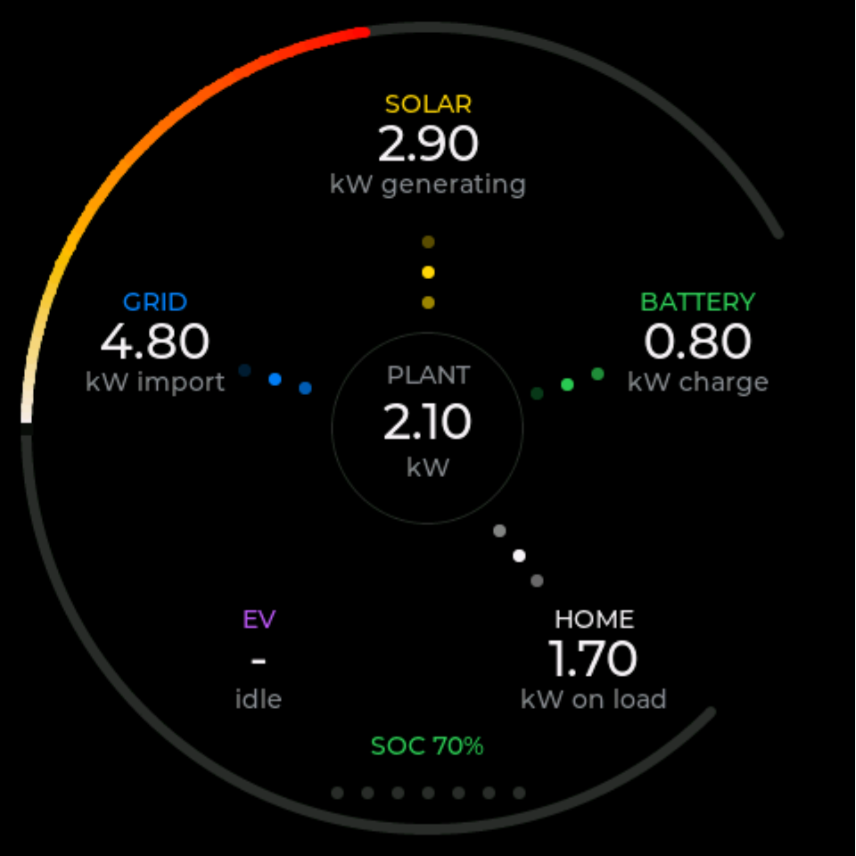

# SigenStorPuck

A touchscreen status display for a Sigenergy SigenStor solar and battery system.

Modified from the original code to instead support the **Guition ESP32-4848S040** board. 

This device features a square 480x480 LCD display and a capacitive touch screen but has no physical buttons or battery.

Screen shows live power flow, battery state, solar generation against
forecast, consumption, where the day's energy went, and what it all cost.

## Two ways to get data — read this first

The Puck can take its readings from either of two places, and it matters which, because
some screens and features need one of them.

**Modbus TCP — talking straight to your plant.** No other software involved. The Puck
reads your inverter or gateway directly over your own network. **This is the only way to
use the Puck today**, and everything below assumes it unless it says otherwise.

**SigenStorDisplay Server.** A separate companion application that manages and logs a
Sigenergy plant, which the Puck can then read from. It unlocks the Flows and Cost
screens, stepping back through past days, and complete daily charts.
**SigenStorDisplay has not been released yet.** The Puck already has full support for it
built in and ready for when it is, but until then those parts are unavailable.

### What works with which

| | Modbus (available now) | SigenStorDisplay Server |
|---|:--:|:--:|
| **Power** screen | ● | ● |
| **Battery** screen | ● | ● |
| **Solar** screen | ● | ● |
| **Load** screen | ◐ headline and live draw only | ● |
| **Flows** screen | — | ● |
| **Cost** screen | — | ● |
| **Settings** screen | ● | ● |
| Solar forecast | ● calculated on the Puck | ● from the server |
| Daily charts | ◐ from when the Puck was switched on | ● the whole day, and after a restart |
| Step back through past days | — | ● up to 7 days |
| Tariff rates and savings | — | ● |

● full · ◐ partial · — not available

On Modbus the Flows and Cost screens are removed altogether rather than left showing
dashes, so you get five screens instead of seven.

## The screens

**Swipe left and right across the glass to move between screens.** The row of dots along
the bottom shows how many there are and which one you are on. If the Puck is out of
reach, holding the **BOOT** button for 2 seconds moves to the next screen too, and the
auto-cycle can step through them on its own — see **Auto-cycle every** under Settings.

Which screens appear at all is up to you — see **Screens** under Settings.

| | |
|:--:|:--:|
|  |  |
| **Power** — what is happening right now. Solar at the top, then clockwise: battery, home, EV, grid, around the plant in the middle. Dots run along each leg in the direction the power is going, faster when there is more of it. The ring is your state of charge.<br><br>*Works on both.* | **Battery** — charge level around the bezel, capacity in kWh, and how long until it is full or empty. Below that: charged and discharged today, battery health, and temperature.<br><br>*Works on both. On Modbus, temperature and the daily totals need an inverter added under Plant.* |
|  |  |
| **Solar** — generation so far today, with the ring showing progress against the day's forecast. Then the forecast total, how much is still to come, how you are doing against it, and the expected peak.<br><br>*Works on both. On Modbus the forecast is calculated on the Puck and needs your location and panels entered under Solar forecast; without them the ring is hidden.* | **Load** — everything used today, with what is being drawn right now.<br><br>*Partial on Modbus.* The headline total, the live figure and the curve all work. The four figures below — house, EV, from solar, from grid — need the daily breakdown, so they appear only with a **SigenStorDisplay Server**. |
|  |  |
| **Flows** — where today's energy came from and where it went. Sources down the left, destinations down the right, one ribbon per path. The ring is how self-sufficient you have been.<br><br>**SigenStorDisplay Server Only.** | **Cost** — what you have saved today, the unit rate you are paying right now, and the next few tariff slots coloured against it.<br><br>**SigenStorDisplay Server Only.** |
|  | |
| **Settings** — always the last screen. Scan the code with your phone, or type either address into a browser, to reach the settings page.<br><br>*Works on both.* | |

Behind the solar, load and battery screens is that day's own curve, drawn faintly so it
does not compete with the figures. On Modbus the curve builds up from the moment the Puck
is switched on, so it starts empty after a restart and fills through the day. With a
**SigenStorDisplay Server** the whole day is fetched, so the curve is complete straight
away.

### The two buttons

| | Press | Hold 2 seconds | Hold 5 seconds |
|---|---|---|---|
| **PWR** | Back one day | Auto-cycle on/off | Power off |
| **BOOT** | Forward one day | Next screen | Restart |

The day buttons are **SigenStorDisplay Server Only** — on Modbus there is no stored
history to step back into, and the buttons say `LIVE ONLY` instead. With a server you can
step back seven days; the Power screen always stays live, and the day you are looking at
is named just above the page dots.

If the screen is off on a schedule, the first press of any button just wakes it up.

## Installing

### 1. Flash the firmware

Plug the Puck into a computer with a USB-C cable and open this page in **Chrome or Edge**:

### → [Install SigenStorPuck](https://markab.github.io/SigenStorPuck/)

It flashes over WebSerial — nothing to download and no drivers to install. Safari and
Firefox cannot do this, and neither can anything on an iPhone or iPad.

After the first flash the Puck updates itself — see **Firmware** below.

### 2. Join it to your WiFi

On first boot the Puck puts up its own WiFi network and shows you the name. Yours will
end in six different characters — it is that device's own name, so two Pucks side by side
do not clash.

<p align="center"></p>

1. On your phone or laptop, join that WiFi network. A setup page opens by itself; if it
   does not, browse to `http://192.168.4.1/`.
2. Tap **Configure WiFi**, pick your home network and enter its password.
3. If this is your second Puck, give it a **device name** on the same page so the two do
   not clash.
4. Save. The Puck joins your network and the screen changes to **Not configured**.

### 3. Open the settings page

The **Not configured** screen shows a QR code and the Puck's own address, given two ways:
the friendly name and the IP. Both appear because not every phone can resolve `.local`
names — if the first does nothing, use the second.

<p align="center"></p>

**Scan the QR code with your phone**, or type either address into any browser on the same
network. The code carries the IP, being the one that always works.

```
http://sigenstorpuck.local/
```

### 4. Point it at your plant

1. Check **Data source** is set to **Plant over Modbus**. It is out of the box.
2. Under **Plant (Modbus)**, enter the IP address of your inverter or gateway. Leave the
   port at `502` and the plant address at `247` unless you know otherwise.
3. Optionally add your inverter as a device — this is what gives you battery temperature
   and the daily totals — and a charger if you have one, for EV power.
4. Save, then **Restart Device** from the Danger section.

Two things to do outside the Puck, or it will not be able to connect:

- In the **Sigen app**, allow Modbus TCP access for the Puck's IP address. Access is
  granted per address, and a device that has not been added simply gets no reply.
- In your **router**, give the Puck a fixed (reserved) IP address, so the permission you
  just granted does not stop working the next time addresses are handed out.

Data should appear within a few seconds of the restart.

> **Using a SigenStorDisplay Server instead**, once it is available: set **Data source**
> to *Server*, then paste the enrolment URL from the server's **Admin → Kiosk devices**
> page into the **Server** section and save. The URL carries the server address and the
> access token together, so that is the only thing you need to enter.

## Settings

Everything below is on the Puck's own settings page at `http://sigenstorpuck.local/`.
Most changes take effect straight away; the ones needing a restart are marked ↻.

### Network

<table>
<tr><th width="32%">Option</th><th>What it does</th></tr>
<tr><td><strong>Device name</strong> ↻</td><td>What the Puck calls itself on your network. The default is <code>sigenstorpuck</code>, reachable at <code>http://sigenstorpuck.local/</code>. Change it if you have more than one Puck.</td></tr>
</table>

### Data source

<table>
<tr><th width="32%">Option</th><th>What it does</th></tr>
<tr><td><strong>SigenStor Display server</strong> ↻</td><td>Read from a <strong>SigenStorDisplay Server</strong>. Not yet available.</td></tr>
<tr><td><strong>Plant over Modbus (LAN only)</strong> ↻</td><td><strong>The default.</strong> Read your inverter or gateway directly. Removes the Flows and Cost screens, which need data only a server has.</td></tr>
</table>

### Plant (Modbus)

*Used on the Modbus source.*

<table>
<tr><th width="32%">Option</th><th>What it does</th></tr>
<tr><td><strong>Gateway or inverter IP</strong></td><td>The address on your network of the device that speaks Modbus TCP.</td></tr>
<tr><td><strong>Port</strong></td><td><code>502</code> unless you have changed it on the plant.</td></tr>
<tr><td><strong>Plant address</strong></td><td><code>247</code> unless you have changed it.</td></tr>
<tr><td><strong>Slave ID</strong></td><td>The address of one device inside the plant, as shown in the Sigen app. <code>0</code> means the slot is unused. Four slots are available; all are optional.</td></tr>
<tr><td><strong>Type</strong></td><td><em>Inverter</em> or <em>Charger</em>. Adding an inverter gives you battery temperature and the daily totals; adding a charger gives you EV power.</td></tr>
<tr><td><strong>DC charger</strong></td><td>Tick if that inverter has a vehicle charger built into it, so its DC output counts as EV power.</td></tr>
</table>

### Server

**SigenStorDisplay Server Only** — nothing here has any effect on the Modbus source.

<table>
<tr><th width="32%">Option</th><th>What it does</th></tr>
<tr><td><strong>Enrolment URL</strong></td><td>Paste the whole URL from the server's Admin → Kiosk devices page. It fills in the server address and access token together. The page shows the last four characters of the stored token so you can tell one device's enrolment from another's.</td></tr>
<tr><td><strong>Test connection</strong></td><td>Fetches data once and reports exactly what happened — the quickest way to find a wrong address or a revoked token.</td></tr>
</table>

### Solar forecast

*Used on the Modbus source only.* With a **SigenStorDisplay Server** the forecast comes
from the server and these are ignored.

<table>
<tr><th width="32%">Option</th><th>What it does</th></tr>
<tr><td><strong>Latitude / Longitude</strong></td><td>Where your panels are. <strong>Leave both blank for no forecast</strong> — the Solar screen then hides its ring rather than showing an empty one. Setting a location also tells the Puck your timezone, which is what lines the daily charts up with your own midnight.</td></tr>
<tr><td><strong>System loss</strong></td><td>Everything between the panels' rating and your meter: inverter efficiency, wiring, dirt on the glass. <code>0.85</code> is a sensible starting point.</td></tr>
<tr><td><strong>Inverter cap</strong></td><td>The most your inverter can put out, in kW. <code>0</code> means no limit.</td></tr>
<tr><td><strong>Size (kWp)</strong></td><td>An array's rating. <code>0</code> leaves that slot unused. Up to four arrays.</td></tr>
<tr><td><strong>Tilt</strong></td><td>The angle from flat. <code>0</code> is horizontal, <code>35</code> is a typical pitched roof, <code>90</code> is vertical.</td></tr>
<tr><td><strong>Azimuth</strong></td><td>A compass bearing: <code>180</code> due south, <code>90</code> east, <code>270</code> west, <code>0</code> north.</td></tr>
</table>

### Display

*All of these work on both sources.*

<table>
<tr><th width="32%">Option</th><th>What it does</th></tr>
<tr><td><strong>Brightness</strong></td><td>Normal running brightness, 0 to 255.</td></tr>
<tr><td><strong>Poll interval</strong></td><td>How often to fetch new readings, in seconds. <code>5</code> is the default.</td></tr>
<tr><td><strong>Dim after</strong></td><td>Seconds of no touching before the screen dims. <code>0</code> never dims.</td></tr>
<tr><td><strong>Dimmed brightness</strong></td><td>How dim it goes. It dims rather than blanking, so it stays readable from across the room.</td></tr>
<tr><td><strong>Screen off from / until</strong></td><td>Hours to switch the screen off completely, for overnight. <strong>Off means off, not dimmed.</strong> Any button brings it back for 30 seconds. Blank both boxes to leave the screen on all the time. The times are the Puck's own local time, which the page shows next to the boxes so you can check it is right.</td></tr>
<tr><td><strong>Orientation</strong> ↻</td><td>Quarter turns, <code>0</code> to <code>3</code>, for mounting the Puck whichever way round suits.</td></tr>
<tr><td><strong>Auto-cycle every</strong></td><td>Seconds between automatically moving to the next screen. <code>0</code> turns it off. Also switchable by holding PWR for 2 seconds.</td></tr>
<tr><td><strong>Sweep every</strong></td><td>Minutes between a brightness band sweeping across the screen. This evens out wear on the panel, which matters on an AMOLED showing much the same picture all day. <code>0</code> turns it off.</td></tr>
<tr><td><strong>Screens</strong> ↻</td><td>A tick per screen for whether it appears at all, and a second for whether the auto-cycle stops on it. Power and Settings are always shown, so their boxes are fixed. On Modbus, Flows and Cost are struck through and cannot be ticked.</td></tr>
</table>

### Firmware

<table>
<tr><th width="32%">Option</th><th>What it does</th></tr>
<tr><td><strong>Install</strong></td><td>Downloads the newer release and applies it. The Puck restarts on its own. Only appears when there is one.</td></tr>
<tr><td><strong>Check now</strong></td><td>Looks for a newer release straight away.</td></tr>
<tr><td><strong>Check for a newer release when this page is opened</strong></td><td>Off by default, so the Puck contacts nothing but your own network unless you ask it to. Tick it to be told about new releases when you open this page. Installing one is always a separate click.</td></tr>
</table>

### Danger

<table>
<tr><th width="32%">Option</th><th>What it does</th></tr>
<tr><td><strong>Restart Device</strong></td><td>Reboots it. Needed after any ↻ change above.</td></tr>
<tr><td><strong>Forget server and token</strong></td><td>Clears your server details. You will need the enrolment URL again.</td></tr>
<tr><td><strong>Forget WiFi and restart</strong></td><td>Clears the WiFi password and brings the setup network back, for moving the Puck to a different network.</td></tr>
</table>

## Troubleshooting

| On screen | What it means |
|---|---|
| **WiFi setup** | Not on your network yet. Join the setup network shown and follow step 2. |
| **Connecting to WiFi** | Joining your network. It should pass in a few seconds. |
| **Not configured** | On WiFi, but it does not know where to get data. Follow steps 3 and 4. |
| **Waiting for data** | Configured, but nothing has arrived yet. Normal just after a restart. |
| **Waiting for clock** | It needs the time from the internet before it can make a secure connection. Passes on its own once your network lets it reach an NTP server. |
| **No data** | It cannot reach the plant, and names the reason underneath. Check the address on the settings page, and check the Puck is still allowed in the Sigen app. |
| **Re-enrol needed** | *Server only.* The access token has been revoked. Create a new kiosk device and paste the fresh enrolment URL. |
| `LIVE ONLY` | You pressed a day button on the Modbus source, which has no stored history to step back into. |

If a Modbus setup worked and then stopped, the usual cause is the Puck's IP address
changing, which quietly invalidates the permission granted in the Sigen app. Reserve the
address in your router and grant it again.

## The stand

TBD

## Hardware

| | |
|---|---|
| Board | Guition ESP32-4848S040 |
| Display | 480×480 IPS LCD 16 bit color, special ESP32-S3 parallel mode The display is supported by the “GFX Library for Arduino” |
| Touch | ST7701, I2C |
| MCU | ESP32-S3R8, 8 MB PSRAM, 16 MB flash |


## Building it yourself

```bash
pio run -e puck -t upload -t monitor
```

Screens are developed against canned payloads on the desktop rather than by reflashing,
which is where every screenshot above came from:

```bash
pio run -e sim && .pio/build/sim/program
```

`n`/`p` change fixture, `[`/`]` change screen, `d` shows the parsed data behind what you
are looking at. `--modbus` previews the shorter five-screen arrangement.

`--selftest` runs the checks that need no hardware: the Modbus register decoder, the
history ring, the button gestures, the solar forecast model and the screen-off window.
